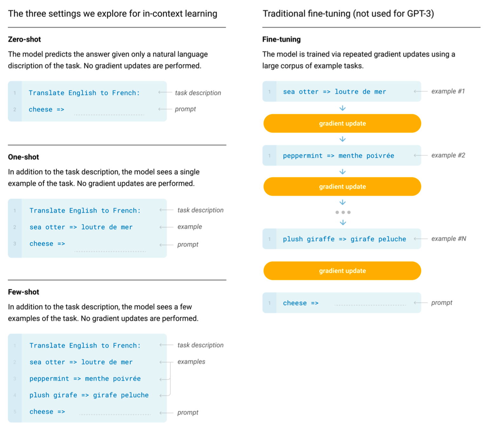
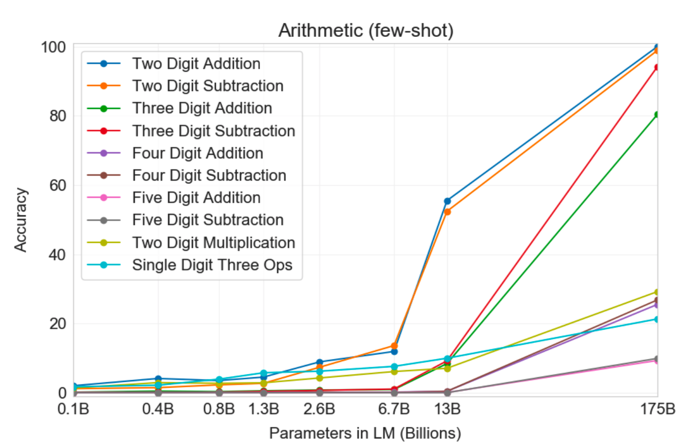
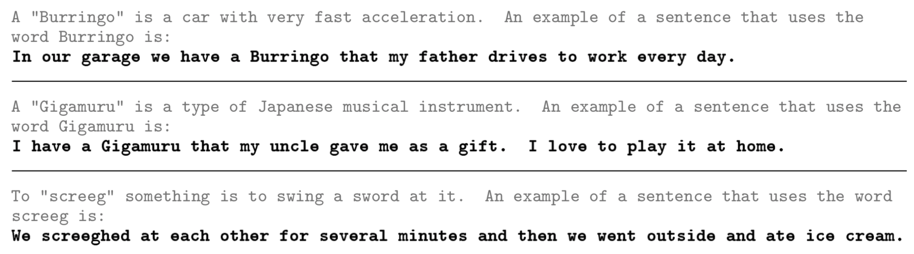
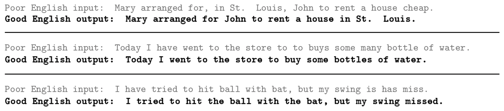
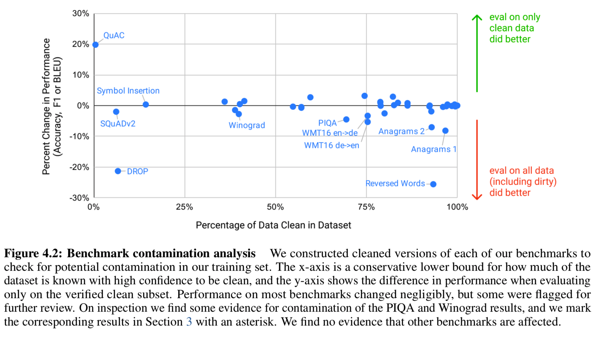

# GPT-3: Language Models Are Few-Shot Learners

OpenAI (2020)

## References

- [arXiv](https://arxiv.org/abs/2005.14165)
- [Code](https://github.com/openai/gpt-3)
- [OpenAI API](https://openai.com/blog/openai-api/)

### Other Reviews

There are more than enough reviews and news articles online related to GPT-3. Here are some:

- [OpenAI's GPT-3 Language Model: A Technical Overview](https://lambdalabs.com/blog/demystifying-gpt-3/)
- [GPT-3: a disappointing paper](https://www.lesswrong.com/posts/ZHrpjDc3CepSeeBuE/gpt-3-a-disappointing-paper)
- [Medium Blog Review](https://blog.inten.to/gpt-3-language-models-are-few-shot-learners-a13d1ae8b1f9)
- [Video Review](https://youtu.be/Mq97CF02sRY)

## Summary

(It's a 72-page paper!)

- Tests the limits of large-scale language modeling by training a 175-billion parameter Transformer language model called **GPT-3**.
- Shows that **few-shot & in-context learning** (no gradient updates!) with GPT-3 can be effective on many known and synthetically created tasks.
    - Claims that sufficient amounts of unsupervised pre-training should supersede task-specific fine-tuning, which the authors claim limits applicability of pre-trained language models.
    - However, it also does not "solve" a majority of these tasks, suggesting that there may be a limit to the effectiveness of continuously scaling up these models (only).
- Discusses limitations of GPT-3 as well as its broader societal impacts.

---

## Introduction

**There are major limitations to the standard approach of unsupervised pre-training then supervised fine-tuning.**

1. The need for a large set of task-specific labels limits the applicability of language models.
2. Large language models can exploit spurious correlations in these task-specific labeled datasets, such that fine-tuning limits generalizability.
3. Humans do not require large supervised datasets to learn most language tasks.

**Language models should be tested on few-shot, one-shot, or zero-shot settings*.**

So the paper examines the performance of GPT-3 in these three settings across numerous previous and new NLP tasks.

**Previous research suggests that the learning capacities of language models show strong gains with scale.**

So the paper tests the limits to the benefit of scale by enlarging models even more (175B).

### *In-Context Learning

> ...using the text input of a pretrained language model as a form of task specification.

- This is the approach taken for few-shot and one-shot settings.
- *No gradient updates are performed.* See illustration below (Figure 2.1 in the paper):

    

## GPT-3

- A 175-billion parameter Transformer language model with 96 layers, 12288 dimensions, 96 heads, along with a 3.2M-token batch size and 2048 context window size.
    - Model is partitioned across V100 GPUs along the depth and width dimensions.
- Trained for 300B tokens, consisting of a "lightly filtered" version of Common Crawl 2016-19 (60%), WebText2 (22%), Books1/2 (8%/8%), and Wikipedia (3%).
    - Hundreds of gigabytes in size (570GB for CC only).
    - Some datasets are seen multiple times, while others are seen less than once.
    - Several thousand petaflop/s-days of compute (x100 GPT-2).

## Results

All results are based on three settings, all with in-context learning (no gradient updates):

- GPT-3 Zero-Shot
- GPT-3 One-Shot
- GPT-3 Few-Shot

Full fine-tuning is left for future work, although it has already been noted in the introduction that full fine-tuning has major limitations anyway.

### Beyond SOTA

Previous SOTAs in parentheses.

1. **LAMBADA long-range language modeling**: 86.4% (68.0%) word accuracy and 1.92 (8.63) perplexity.

    > [BHT+20] [...] argue that "continuing to expand hardware and data sizes by orders of magnitude is not the path forward". We find that path is still promising and in a zero-shot setting GPT-3 achieves 76% on LAMBADA, a gain of 8% over the previous state of the art.

2. **Penn Tree Bank language modeling**: 20.5 (35.8) perplexity.
3. **TriviaQA (open-domain QA but *closed-book*)**: 71.2 few-shot, 68.0 one-shot (68.0 fine-tuned AND open-book).
4. **WMT'16 Translation *to* English**: 39.2 (35.0 supervised, 34.9 unsupervised) few-shot Fr→En, 40.6 (40.2 supervised, 35.2 unsupervised) few-shot De→En, 39.5 (39.9 supervised, 33.1 unsupervised) few-shot Ro→En.
5. **PIQA**: 80.5 zero-shot, 82.8 few-shot (79.4 fine-tuned). Possible data contamination though.

### Not as good as fine-tuned SOTA

Some still impressive, because these are few-shot results and involve no gradient updates.

1. **Winograd & Winogrande**: 89.7 (90.1) one-shot WSC273, 77.7 (84.6) few-shot Winogrande.
2. Some **completion** tasks (83.2-87.7 on StoryCloze, 78.1-79.3 on HellaSwag)
3. **Open-book QA** tasks (Natural Questions, WebQuestions, ARC, OpenBookQA, ...)
4. **Translation *from* English**
5. **Reading comprehension** tasks (SQuAD, RACE, QuAC, DROP, CoQA)
6. **SuperGLUE**
7. **NLI** (RTE, ANLI)

### Synthetic Tasks

Or not quantitatively evaluated on a benchmark dataset.

1. **Basic Arithmetic**: can do addition and subtraction with the larger models. See few-shot results in the following figure (3.10 in the paper):

    

2. **Word Scrambling and Manipulation**: can remove randomly inserted characters (~70%) and solve some anagrams (~40%).
3. **SAT Word Analogies**: 65.2% few-shot (57% college applicants)
4. **(Fake) News Article Generation**: human accuracy for detection is ~52% on average, for the largest GPT-3 model.
5. **Learning and Using Novel Words**: (no quantitative evaluation)

    

6. **Correcting English Grammar**: (no quantitative evaluation)

    

## Benchmark Contamination Analysis

Remove all benchmark examples that have a 13-gram overlap with anything in the pretraining set.

The authors examine each possibly problematic downstream task in Section 4. Conclusions vary for each task (e.g., certain RC passages were present but the questions and answers were not; not reporting LM scores for Wikipedia and CBT due to overlaps; 132 Winograd schemas were included; potential issues with PIQA are tricky to verify.)

## Limitations

Several, but notably:

- **Document Generation**: repetition, contradiction, incoherence, and non-sequiturs.
- **Lack of Bidirectionality**: notable performance gap on fill-in-the-blank tasks (WiC, ANLI, ...)
- **Potential Limits to the LM Objective**: entity prediction, tasks requiring actions (e.g., virtual assistants), visual or physical grounding
- **Few-Shot Learning or Task Memorization?**
- **Poor Sample Efficiency**
- **Excessive Model Size**
- **Lack of Interpretability**

## Broader Impacts

Many interesting analyses of GPT-3 with respect to misuse, fairness, and energy usage.

For example, the authors identify biases associated with gender, race and religion.
