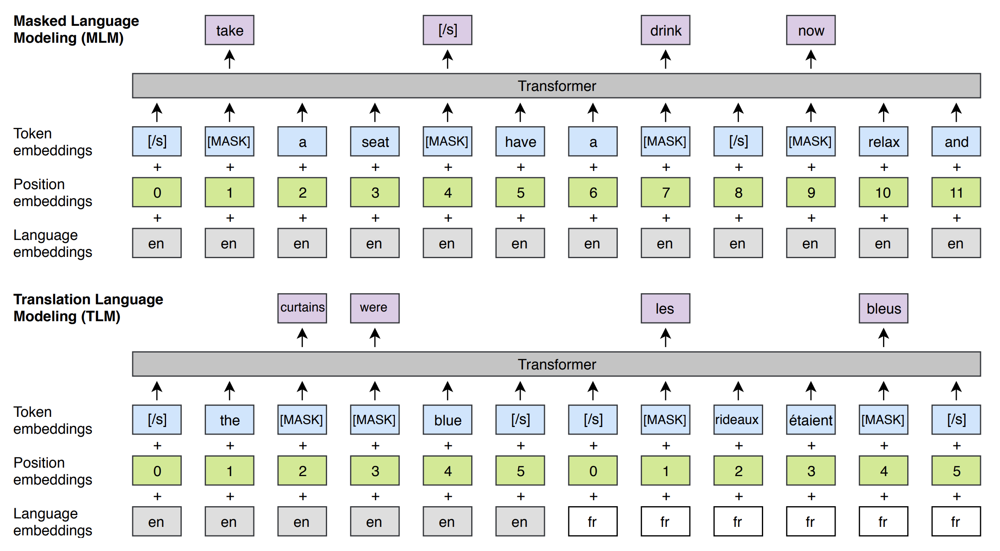
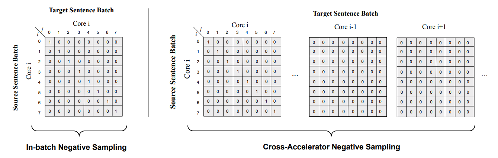
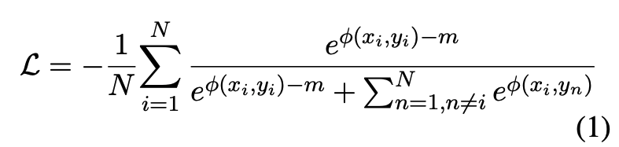
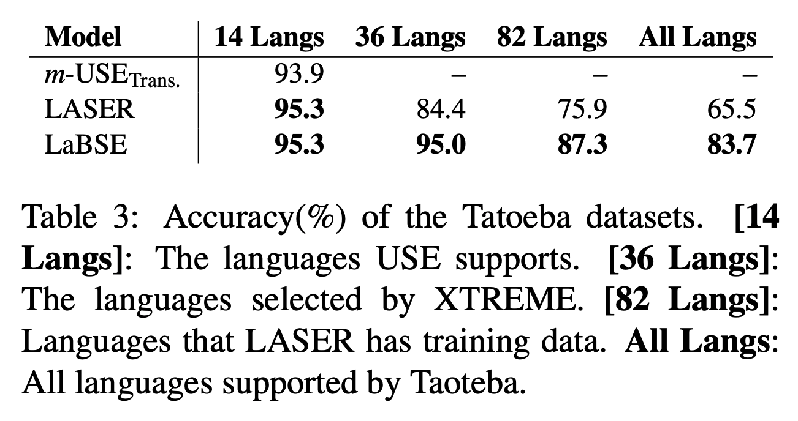
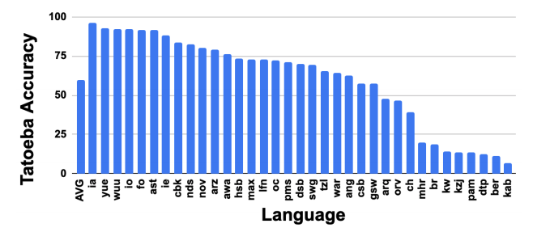
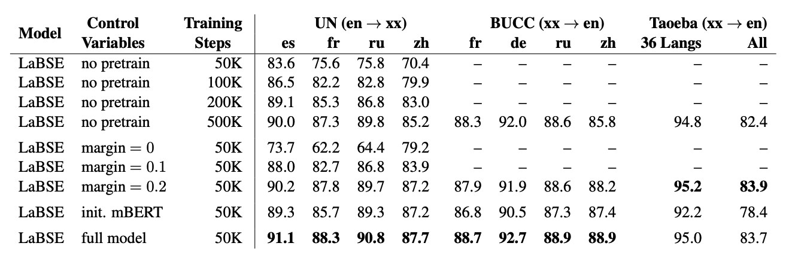

## Language-agnostic BERT Sentence Embedding

### References

- LaBSE: [arxiv](https://arxiv.org/abs/2007.01852)
- [TF-hub](https://tfhub.dev/google/LaBSE/1) 

### Summary

- Google의 **Universal Sentence Encoder** Family의 후속 연구
- BERT에서 제시된 **MLM** + XLM에서 제시된 **TLM을** 활용한 1차 사전 학습
- Universal Sentence Encoder에서 제시된 **Translation Ranking Task**를 활용한 2차 사전 학습
- 두 단계의 사전 학습 전략과 **CommonCrawl** + **Wikipedia**의 거대 Mono-lingual 코퍼스, **병렬 데이터 추출 인하우스 모델**을 활용해 추출한 Parallel 코퍼스를 활용해 **109개 언어**에 대해 SOTA **Cross-Sentence Retrieval** 성능 달성 

### Notes

- 최근 **Multilingual Sentence Embedding** 관련 연구에서는 **SentenceBERT**에서와 같이 **Dual Encoder**를 활용하는 시도가 많아짐
- 그러나, **MLM**과 같은 사전학습이 주는 영향에 대한 연구는 활발하게 수행되지 않음
- **Multilingual BERT(mBERT)**의 사례를 되짚어 보면, **mBERT**는 다양한 언어로 작성된 단일 언어 데이터에 대해 **MLM**을 반복적으로 수행하기만 했을 뿐인데 **좋은 Multilingual Embedding**을 지닐 수 있었음
- 그렇다면 **MLM + TLM** 을 활용한 사전학습이 수행되어야 **Multilingual Representation**이 좋아지는 것이 아닐까?

- 해당 사전학습을 위해서는 단일 언어로 작성된 **CommonCrawl** + **Wikipedia** 코퍼스를 정제하여 활용
  - **문장 분류기** 활용: 문장 인스턴스가 *메인 컨텐츠인지 아닌지* 를 판별해주는 이진 분류기
  - **109개 언어**에 대해 총 **17B 개의 단일 언어 문장 인스턴스**를 확보

- 2차 훈련을 위해 앞서 사전학습된 커스텀 BERT로 **Dual Encoder** 초기화
- 병렬 코퍼스는 다음과 같은 과정을 통해 구축
  - [Bi-text Mining 시스템](https://dl.acm.org/doi/pdf/10.5555/1873781.1873905)을 통해 웹 페이지들로부터 병렬 번역 데이터 추출
  - 추출된 번역 쌍을 바로 사용하지 않고, 데이터의 품질을 평가해주는 [모델](https://www.aclweb.org/anthology/W18-6314.pdf)을 활용
  - Threshold 설정해 특정 스코어 넘은 데이터만 훈련 데이터로 활용; **약 80%의 쌍이 남도록** 설정
- 이렇게 구축된 데이터를 활용해 수행하는 2차 훈련은 **Translation Ranking Task**
  - 이는 Source가 영어 Target이 한국어라고 하였을 때, **올바른 쌍을 찾아주는 태스크**
  - 즉, 훈련 코퍼스를 통해 구축한 **(x, y)** 쌍에서 x 를 보고 올바른 y 를 찾는 태스크
- 마지막 레이어의 **[CLS] 토큰** 간 **코사인 유사도**를 높이는 방식으로 훈련이 진행

- DPR 에서도 마찬가지였지만, 위 같은 훈련은 **배치 사이즈가 클수록** 효율적; **더 많은 Negative Sample**을 볼 수 있기 때문
- **In-batch Negative Sampling**에서는 배치 내 자기 자신을 제외한 **다른 인스턴스들을 모두 Negative로 설정해 학습**하는 효율적 훈련 방법
- 그러나, BERT는 모델 자체가 **Memory-heavy** 하기 때문에 무작정 배치 사이즈를 키울 수는 없음
- 이를 해결하기 위해 병렬 학습 과정에서 **다른 Accelerator에 들어간 모든 인스턴스들을 Negative Sample로 브로드 캐스트**하여 학습

- **Multilinguale USE** 에서도 **활용된 Additive Margin Softmax**는 Softmax를 구하는 과정에서 **Margin** 값을 주어 훈련을 극대화하는 방안
- 위 식에서는 **올바른 번역 쌍의 코사인 유사도**를 `m` 만큼 줄인 상황에서도 `x_i` 가 주어졌을 때, `y_i` 를 찾아내도록 하는 가혹한 훈련 (m = 0.3)
- 이 두 가지 학습 과정을 통해 **LASER**, **m-USE** 등 기존의 Multilingual 모델들보다 BUCC, UN, Tatoeba 벤치마크 성능 압도

- 특히 **Tatoeba** 에서의 결과가 재밌는데, **m-USE** 에서 제공하는 **High-resource 언어**들에서는 다른 두 모델들과 유사한 성능을 보이다가 언어가 추가되는 과정에서 **평균 성능에 격차가 벌어지는 것**을 확인할 수 있음

- 또한 사전학습 과정에서 단일 언어 데이터로 들어가지 않았지만, **Tatoeba** 에는 존재하는 **30+개 언어**에 대한 **Zero-shot 성능**도 뛰어남
- **약 1/3 언어에 대해서는 75% 이상의 성능**을 보였으며, **7개 언어만 25% 미만의 성능**을 기록
- 이는 **109개 라는 단일어 학습**을 통해 얻어진 **501,153개의 Vocab** 이 **어족의 특성**을 잘 반영했다는 반증

- 모델에 적용한 **사전학습**, **Additive Margin** 등에 대한 **Ablation Study**도 진행
- 연구에 활용된 인하우스 모델이 점점 많아지고 있는 추세...
  - 단일 언어 코퍼스 문장 품질 분류기
  - Bi-text Mining 시스템 내 번역기
  - 번역기 활용해 병렬 데이터 추출하는 Bi-text Mining 아키텍처
  - 번역 쌍 품질 평가해주는 품질 평가 모델 