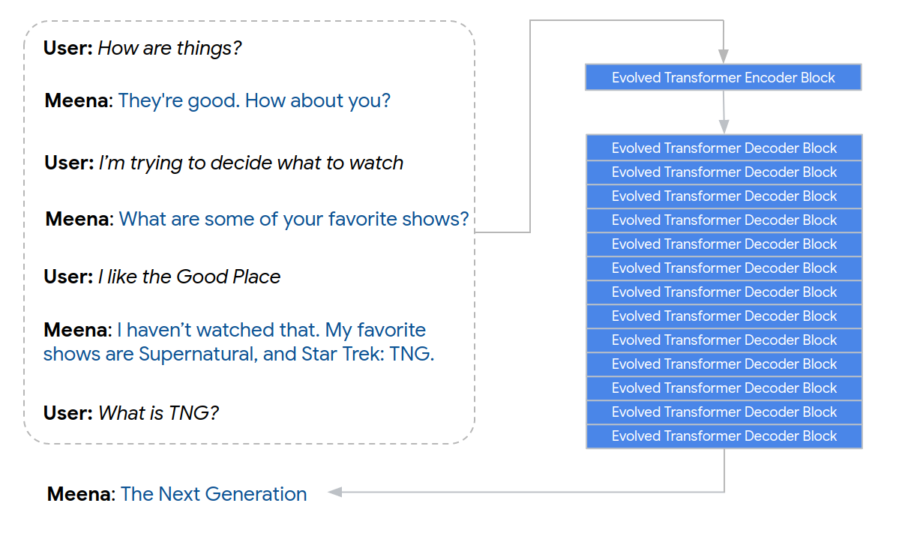
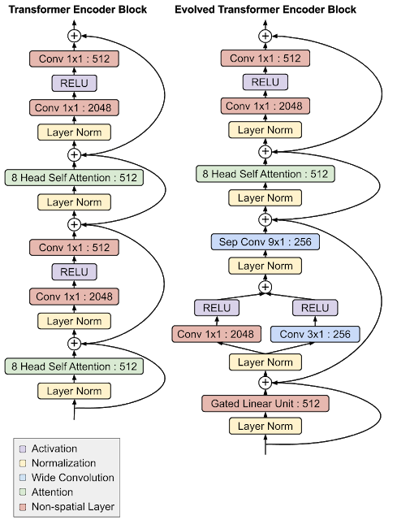

# Towards a Human-like Open-Domain Chatbot

a.k.a. **Meena**

Adiwardana et al., Google Research, Brain Team

arXiv 2020

## References

- [arXiv](https://arxiv.org/abs/2001.09977)
- [Google Blog](https://ai.googleblog.com/2020/01/towards-conversational-agent-that-can.html)
- [Sample Conversations](https://github.com/google-research/google-research/tree/master/meena)

## Summary

- Presents **Meena**, a 2.6B-parameter Transformer language model trained on public domain social media conversations.
    - Data: 40B words (61B subwords), most likely sourced from Reddit.
    - Model: A seq2seq Evolved Transformer model with a 1-layer encoder (for context) and a 14-layer decoder (for response). 2.6B is 1.7x the number of parameters in the largest GPT-2 model.
    - 7% increase in SSA after filtering and tuned decoding.
- Introduces a human evaluation metric called **Sensibleness and Specificity Average (SSA)**, which closely correlates with model perplexity.
    - Human: 86%, Best Meena: 79%, End-To-End Meena: 72%
    - Both Meena models have significantly higher SSA than existing neural chatbots (Cleverbot, Mitsuku, DialoGPT, XiaoIce).

---

## Sensibleness and Specificity Average (SSA)

### Definition

- Sensibleness: Does this response *make sense*?
    - (Claim) includes common sense, logical coherence, and coherence.
- Specificity: Is this response *specific to context* (i.e., cannot be used in "dozens of different contexts")?
    - (Claim) includes diversity of responses.
- SSA = (sensibleness + specificity) / 2

### Human Evaluation

SSA is a *human* evaluation method. Given a context and a response, humans are asked:

1. Is this response sensible?
    1. (If Yes) Is this response specific?
    2. (If No) *considered not specific either.*

### Justifications

- Humans "reasonably" agree with each other on their sensibleness and specificity labeling.
- DialoGPT (51%), made of GPT, scores higher than GenericBot (39%), which only answers "I don't know" and "ok".
- SSA correlates (R^2=0.96) with human likeness, measured simply by asking humans "is this response humanlike?".

### Static vs. Interactive

- Static: 1,477 conversational contexts between 1 and 3 turns are provided, response is evaluated (= Mini-Turing Benchmark or MTB)
- Interactive: crowdworkers converse with bots for 14-28 turns *about anything they wanted*. Each bot is evaluated 100 times and each response is evaluated (i.e., 700+ responses evaluated for SSA).
    - Unlike Turing test, crowdworkers know they're talking with bots.
        - (Claim) This shifts the focus from detecting deception to detecting human-like qualities.
    - [Ghandeharioun et al. (2019)](https://arxiv.org/abs/1906.09308) instead evaluates the conversation as a whole.

## Training Data

- "Public Domain Social Conversations" (probably Reddit?)
    - Essentially, message trees involving multiple speakers.
    - Treat each message as a response and all previous turns (up to 7) as context.
    - After filtering, this amounts to 867M `(context, response)` pairs.
    - This amounts to 341GB of text, containing 40B words (or 61B subwords).
    - Best PPL: 10.2 (ET), 10.7 (Transformer)

## Model Architecture

- An *uneven* seq2seq model with Evolved Transformer blocks.
    - This is to understand the context bidirectionally while focusing on learning to generate.
- 1 encoder and 13 decoder blocks
- 2,560 hidden size with 32 attention heads
- Maximum of 128 sequence length for encoder and decoder (each)
- 8K SentencePiece vocabulary
- Decoding (at test time): sample-and-rank
    - NOT beam search.
    - top-k (k=40) nucleus sampling ([Holtzman et al., 2019](https://arxiv.org/abs/1904.09751)) is used for the full model (2%+ SSA improvement).

### Comparing Transformer and Evolved Transformer Blocks

An [Evolved Transformer](https://ai.googleblog.com/2019/06/applying-automl-to-transformer.html) block is about as twice as large as a Transformer block and contains convolutional layers before self-attention. 
This block architecture was discovered using Neural Architecture Search (NAS) applied to WMT machine translation. 
Note that [lightweight and dynamic convolutions](https://arxiv.org/abs/1901.10430) also involve convolutional layers in a Transformer-like architecture, but the LightConv or DynamicConv layer replaces self-attention layers instead. 

## Results

- See samples (in paper and in the link above).
- Both interactive sensibleness and specificity correlate highly with perplexity, which is better for larger models.
    - Both static SSA (std 0.02) and interactive SSA (std 0.01) were consistent enough across 7 different evaluations.
- The largest (2.6B) model actually overfits the 61B-token dataset, after 164 epochs.
- For decoding, sample-then-rank (temperature-based sampling + ppl-based reranking) performs much better than beam search and is "good enough" given large enough models.
    - Sampling: N = 20, T = 0.88 works the best.

## Further Improvements (base → full)

Two improvements to push SSA from 72% to 79%:

- Top-k nucleus sampling (k=40, N=20, T=1.0): 72% → 74%
- Rule-based restriction on cross-turn repetitions: 74% → 79%

Also added a "safety layer" that classifies potentially sensitive or toxic responses.
