## PLATO: Pre-trained Dialogue Generation Model with Discrete Latent Variable

### References

- PLATO: [ACL 2020](https://www.aclweb.org/anthology/2020.acl-main.9/)
- PLATO-2: [arXiv](https://arxiv.org/abs/2006.16779)

### Summary

- 대화 모델은 **UniLM** 처럼 **Bi-directional** + **Uni-directional** 활용하는 것이 좋다:  컨텍스트 임베딩 + 대답 생성
- 대화 모델에 있어 고질적인 문제 **one-to-many** 매핑 문제를 **Discrete latent variable**로 해결하고자 함
- **Pre-trained Tasks**: **Latent act recognition** + **Response generation**

### Introduction

- *코퍼스 부족* + *발화 간 너무 다양한 관계* + *발화자 정보 추출 어려움* 삼위일체로 인해 **대답 생성 모델**은 **어려움**
- **BERT** + **사전 학습**으로 해결하려는 시도들 있었으나 부족한 결과
  - 일반 텍스트와 대화 텍스트의 언어학적 패턴이 다르게 나타남
  - 대화 생성에서의 Uni-directional 이 BERT 의 Bi-directional 과 다름
  - 대화 간에는 one-to-many 매핑 문제가 발생: 꼭 하나의 정답이 있는 것은 아님
- 위 문제를 해결하기 위해 우리가 취한 방법은
  - 일반 텍스트 사전 학습 이후, Reddit + Twitter 대화 코퍼스에 대해 추가 사전 학습
  - Bi-directional + Uni-directional 을 모두 활용하여 모델 학습
  - one-to-many 매핑을 모델링하기 위해 Discrete latent variable 활용: 각 라벨이 특정 인텐트 (latent speech act)
- Discrete latent variable 활용함에 따라 특정 라벨에 대한 어노테이션 과정을 거치지 않아도 되게 됨

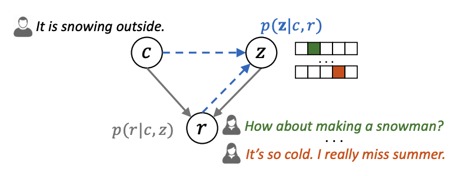

- *대화 컨텍스트 c*, *대답 r*, *latent variable z* 로 모델링: latent variable z* 는 20개 중 하나 카테고리로 결정됨

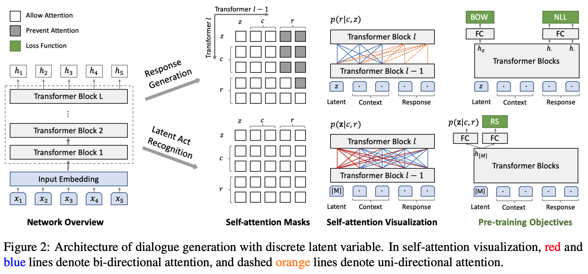

- *Latent Act Recognition* 에서는 **Bi-directional** Self-attention, *Response Generation* 에서는 **Uni-directional** Self-attention 이 적용

### Training

- 사전 훈련된 BERT base 에서 시작해 Reddit, Twitter 대화 코퍼스에 대해 2차 사전 학습
- 훈련 샘플이 되는 _(c, r)_ 는 _Latent Act Recognition_, _Response Generation_ 을 위해 2번 씩 활용
  - _(c, r)_을 활용해 _discrete latent variable z_ 를 모델링
    - 이때, _Response Selection (RS)_ 가 추가적으로 수행
    - _RS_ 는 여러 개의 대답 후보군이 생성되었을 때, 문맥에 가장 부합하는 대답을 선택하는데 도움이 되는 서브 태스크
    - 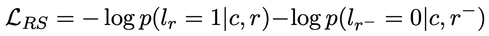
    - _r+_ 는 훈련 샘플에서 바로 활용하며, _r-_ 는 코퍼스에서 임의로 추출해 활용
  - _p(z|c, r)_ 을 통해 얻어진 _z_ 를 활용해 대답 생성 수행
    - 대답 생성에 대해서는 _NLL_ 에 더해 _BoW_ 가 서브 태스크로 수행
    - 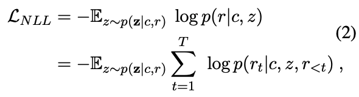
		- 앞서 얻어진 _latent variable z_ 와 문맥 정보 _c_ 를 활용해 대답 _r_ 을 토큰 단위로 생성하며 발생하는 Loss
  	- 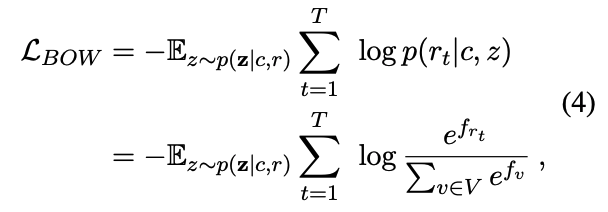
  	- _BoW_ Loss는 _discrete latent variable_ 을 보다 잘 학습하기 위해 추가적으로 수행하는 서브 태스크
  	- 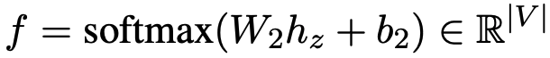
  	- _V_ 는 전체 사전을 의미하며, 함수 _f_ 는 _latent variable z_ 의 마지막 Hidden state
  	- 즉 _z_ 가 주어졌을 때, 각 대답 시퀀스 _r_ 을 구성하는 토큰들이 등장할 확률을 높이는 방식으로 _z_ 를 추가 훈련
  	- _BoW_ 는 시퀀스의 등장 순서는 고려하지 않고, "이런 유형의 토큰들이 _z_ 와 함께 등장해야 한다!" 라는 방향으로 학습이 이루어짐
  - 위에서 얻어진 모든 Loss를 합쳐 역전파 통해 모델 최적화

### Result

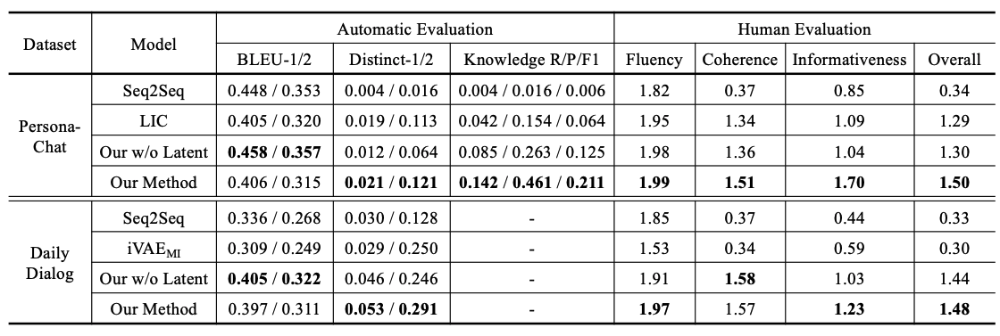

- `Distinct-1/2 ` 는 참신한 표현의 사용 여부, `Knowledge R/P/F1` 은 배경 지식을 얼마나 잘 반영했는지에 대한 지표

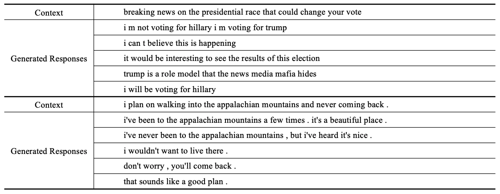

- 하나의 _Context_ 에 대해 잠재 변수 _z_ 를 활용해 다양한 _Reponse_ 를 생성해내는 모습

## PLATO-2: Towards Building an Open-Domain Chatbot via Curriculum Learning

### Abstract

- 세 단계의 훈련 과정을 통해 **Curriculum Learning** 을 활용한 Open-Domain Chatbot 모델링
  - **Coarse-grained Generation**: *one-to-one* 매핑으로 대답 생성
  - **Fine-grained Generation**: _Latent variable z_ 를 활용한 *one-to-many*의 다양한 대답 생성
  - **Response Coherence Estimation**: 대답이 문맥과 얼마나 부합하는지 평가
- 대형 코퍼스에서 의도치 않게 발생할 수 있는 표현 및 편향 문제를 해결하기 위해 인간이 어노테이트한 데이터 추가 활용 ( *follow Blender* )
  - Blender가 강조한 챗봇이 지녀야 할 역량: engagingness, knowledge, empathy and personality
  - 이러한 역량을 지닐 수 있도록 설계된 Human-annotated dataset 을 활용해 Fine-tuning

### Arch. & Training

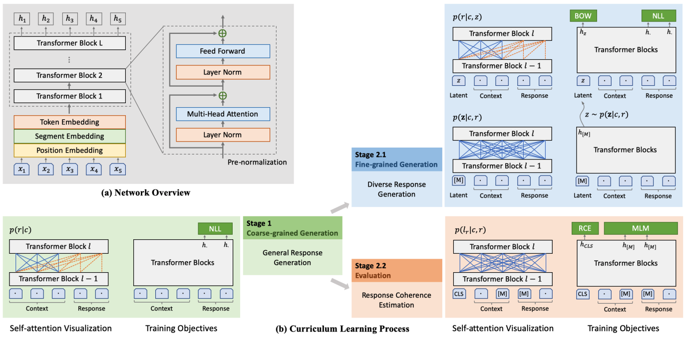

- **General Response Generation**
  - *one-to-one* 매핑으로 대답을 생성하는 것이 단조로움을 낳기도 하지만, 가장 일반적인 대답 특징을 학습할 수 있음
  - 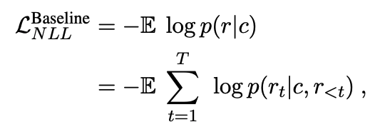
- **Diverse Response Generation**
  - **PLATO-v1** 과 마찬가지로 Latent act recognition 으로 *latent variable z* 를 샘플링 한 후,
  - _z_ 를 활용한 **NLL** + **BoW** Loss 를 계산해 훈련에 활용
- **Response Coherence Estimation**
  - 대답이 문맥에 얼마나 부합하는지를 측정하는 것은 매우 중요한 측정 과제
  - 어떤 기준으로 측정을 할 것인가?
    - _forward_ : _p(r|c)_ 을 활용하면, 모델은 안전한 대답만을 생성하려는 경향 보이게 됨 (Safe response)
    - _backward_: *p(c|r)* 을 활용하면, 모델은 컨텍스트와 중독된 단어를 사용해서 대답을 생성하려는 경향 보이게 됨 (Repetitive conversation)
    - _discriminative_: **PLATO-v1** 에서 활용한 **Response Selection (RCE)** 이 가장 효과 좋음
    - 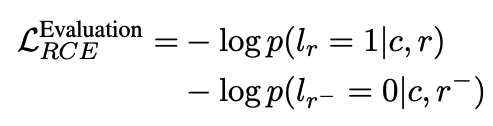
    - _RCE_ 를 하면서 표현력을 잃지 않기 위해, **MLM**을 서브 태스크로 같이 수행

### Result

- Dialo-GPT, Blender, XiaoIce (중국 내 MS 챗봇) 를 베이스라인으로 선정해 결과 비교했으며, 대부분의 베이스라인 모델들보다 좋은 성능
- **셀프 대화 예제**

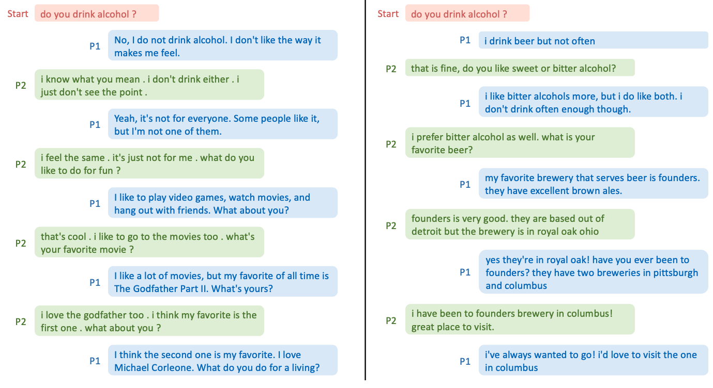

- **사람 - 봇 대화 예제**

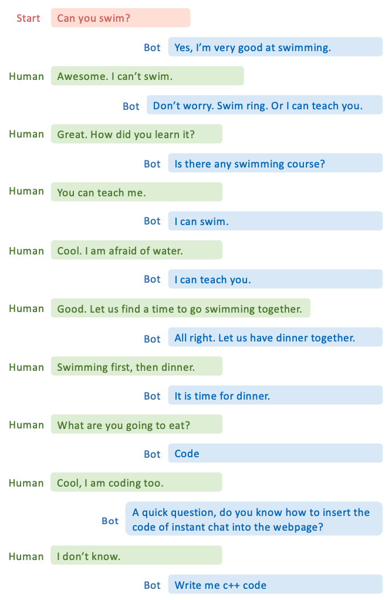

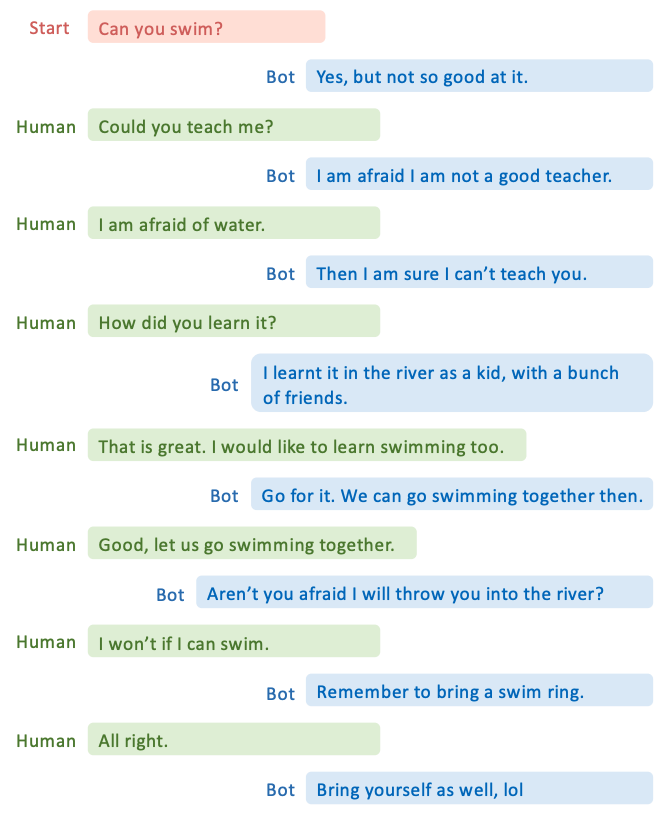

