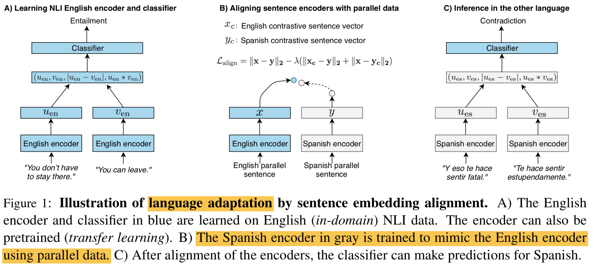
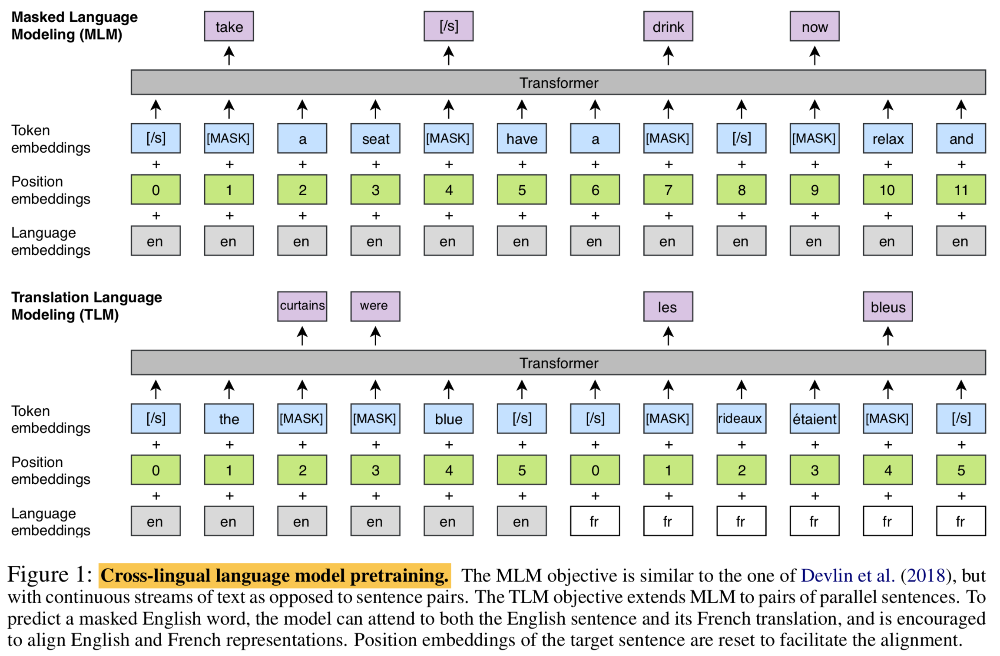

# XLU: Cross-Lingual Language Understanding

## References

- [XNLI: Evaluating Cross-lingual Sentence Representations](https://arxiv.org/abs/1809.05053)
- [Cross-lingual Language Model Pretraining (XLM)](https://arxiv.org/abs/1901.07291)
- [Unsupervised Cross-lingual Representation Learning at Scale (XLM-R)](https://arxiv.org/abs/1911.02116)

---

## XNLI

Conneau et al., EMNLP 2018

### Summary

- Monolingually trained models (obviously) cannot be used beyond that language → need XLU: **train (mostly) on one language but evaluate on many others**.
- Introduces an evaluation set for XLU by extending dev/test sets for MNLI to 15 languages, including low-resource languages.
- Provides several baselines for XNLI, including MT-based models and aligned sentence embedding models.

### Cross-Lingual NLI

1. **Translation-Based Approaches**
    - `Translate Train`: Translate training data, train classifier in target language and evaluate.
    - `Translate Test`: Train classifier in source language, translate test data into source language and evaluate.
2. **Multilingual Sentence Encoders**
    - Align word/sentence embeddings (X-CBOW, X-BiLSTM).
        - Word embeddings: MUSE (SVD on word pairs)
        - Sentence embeddings: MT datasets (Contrastive loss on MT; see figure below)
            
    - Language-universal sentence encoders.
        - Shared encoder trained on many high-resource languages.

### Results

- Translation offers a strong baseline for XLU.
    - `Translate Test` with BiLSTM-Max performs consistently better for all languages.
    - Performance across languages is "very well-correlated" to the BLEU scores.
    - MT system is internal (assumed high-quality), so MT baselines outperform multilingual sentence encoders.

---

## XLM

Lample and Conneau, NeurIPS 2019

### Summary

- Proposes two methods to learn cross-lingual language models (XLMs): **unsupervised monolingual training (CLM or MLM)** and **supervised translation language modeling (TLM)**.
- Achieves state-of-the-art (at the time) for XNLI (+4.9%), unsupervised MT (+9 BLEU on WMT'16 de-en), and supervised MT (+4 BLEU WMT'16 ro-en) — with the same model!
- Shows that XLMs can also lower the perplexity of low-resource language models.

### XLM Objectives

Note that the input vocabulary is shared across all languages considered. BPE vocabulary is built by sampling enough sentences from each language.

1. **Causal Language Modeling (CLM)**
    - Simple forward LM on monolingual data for each language. Each batch comes from one language (sampled from multinomial).
2. **Masked Language Modeling (MLM)**
    - BERT's MLM on monolingual data for each language. Deep bidirectional version of CLM.
3. **Translation Language Modeling (TLM)***
    - Extend MLM by using `[/s] sent_lang1 [/s] sent_lang2 [/s]` and masking tokens from both sentences. *Model can leverage the other language's context if the monolingual context is insufficient.*

When combining CLM/MLM with TLM, training alters between both objectives. 

### Downstream Tasks

1. **Cross-Lingual Classification (XNLI)**
    - `Zero-shot`:  Fine-tune XLM on English MNLI. → Evaluate on 15 XNLI dev/test sets (no MT!).
        - 71.5% with MLM only = fully unsupervised SOTA
        - 75.1% with MLM+TLM = outperforms `Translate Test`
    - `Translate Train`: Translate English MNLI using MT system. → Fine-tune XLM on the translated MNLI dataset. → Evaluate on XNLI dev/test.
        - 76.7% = outperforms `Translate Test`
2. **Unsupervised Machine Translation**
    - Initialize both encoder and decoder of the seq2seq model with MLM or CLM.
    - Fine-tune with a DAE loss and an online back-translation loss.
    - MLM/MLM config achieves the best overall performance (+9 BLEU from previous SOTA).
3. **Supervised Machine Translation**
    - Initialize both encoder and decoder of the seq2seq model with MLM or CLM.
    - Fine-tune with the MT dataset.
    - MLM/MLM config + back-translation achieves the best performance (+4 BLEU from previous SOTA).
4. **Low-Resource Language Modeling**
    - When training CLM on a low-resource language (Nepali), additionally training with a similar (Hindi) or distant (English) language improves the perplexity.
        - -17.1 when incorporating English.
        - -41.6 when incorporating Hindi.
        - Most reduction when incorporating both.

---

## XLM-R

Conneau at al., ACL 2020

### Summary

- Extends XLM to 100 languages, with 2.5TB of data sourced from CommonCrawl, to achieve new SOTA on XNLI and other XLU tasks.
    - `Translate-Train-All` performs the best on XNLI.
    - Approach follows [CCNet](https://arxiv.org/abs/1911.00359), a way to collect high-quality data from CommonCrawl (i.e., filter using monolingual LM).
    - Input vocabulary size is much larger (250K), but no additional Transformer blocks were added (24 blocks).
- Claims the existence of the transfer-dilution tradeoff due to *the curse of multilinguality*, although the curse can be alleviated by increasing model capacity (in vocab size, specifically).
    - XNLI accuracy increases up to a certain number of languages and then starts degrading.
- Claims that multilingual models can still be competitive against monolingual models.
    - XLM-R achieves competitive performance on English GLUE.
    - XLM-7 achieves higher accuracy than monolingual BERT on the 7 languages considered for XNLI.
    