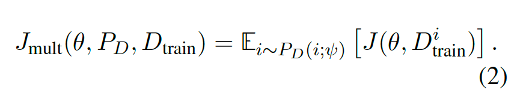
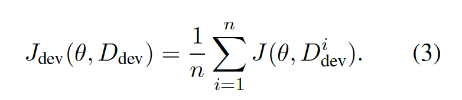
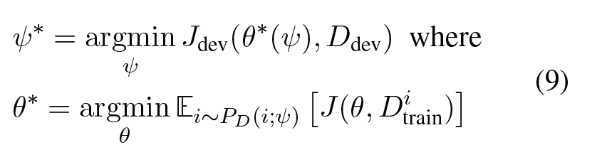
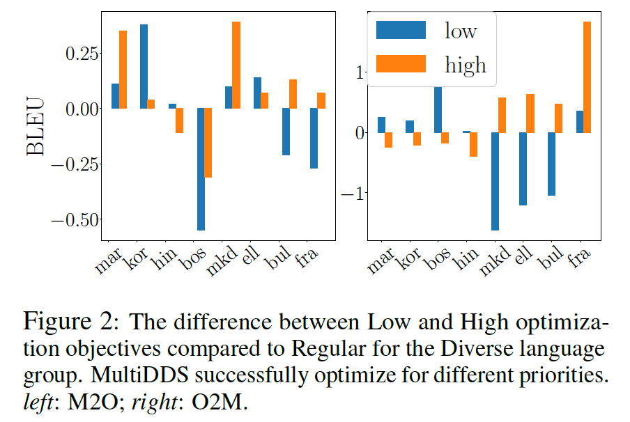

# Balancing Training for Multilingual NMT

ACL 2020

## Resources

- [arXiv](https://arxiv.org/abs/2004.06748)

## Summary

- 목적: 모든 test language에 대한 performace를 maximize
- 기존 방법: low-resource language를 특정 비율로 upsampling 하는 등의 heuristic을 사용
- 모든 test language로 dev set을 만들고, 이에 대해 DDS를 적용하여 어느 language의 training sample을 얼마나 볼 것인지를 모델이 학습하도록 함
- Multiple language에 대한 multiple objective에 대하여 optimize 하는 알고리즘을 MultiDDS라 명명하고, 이를 stable 하게 학습하는 방법을 MultiDDS-S 라고 명명함
- Many-to-one, one-to-many multilingual NMT에서 좋은 성능을 보였고, 특히 MultiDDS-S는 MultiDDS에 비해 low-variance를 보여서 더 안정적.

## Introduction

- 왜 multilingual model을 쓰는가?
  - 각 언어에 대한 monolingual model을 만드는 것 보다 resource efficient
  - High-resource language의 knowledge를 low-resource language에 transfer 할 수 있음
- Multilingual model의 common problem
  - 서로 다른 language가 서로 매우 다른 property를 가짐
  - Data imbalance; LRL은 다른 언어로부터 이득을 볼 수 있지만, HRL은 performance decrease가 일어날 수 있다.
- 서로 다른 언어 간의 balancing 방법 (기존 approach)
  - LRL oversampling; sampling by temperature의 문제점
    - temperature 값에 따라 매우 많이 변함
    - data size 말고 다른 factor은 무시함 (language similarity 등...)
- 그렇다면: language scorer을 둬서, 모든 언어에 대한 performace를 높이기 위해 어떤 언어를 얼마나 볼 것인지를 학습하자

## Objective

- Overall multilingual training objective

  

- Minimizing the average of dev risks

  

- MultiDDS objective

  

자세한 formulation은 [DDS 논문](Optimizing_Data_Usage_via_Differentiable_Rewards)을 참고하는 것이 좋다.

## Experiment

- Main result; M2O and O2M multilingual NMT

  

  - MultiDDS가 baseline은 3/4에서 이겼고, MultiDDS-S가 MultiDDS를 3/4에서 이겼다.

- Dev set이 어디에 집중하는지에 따라 priority를 줄 수 있다. 예를 들어 다음과 같이 나눠볼 수 있다.

  - Regular: 모든 언어에 대해 average dev risk을 사용하는 standard MultiDDS
  - Low: the worst dev perplexity를 갖는 4개 언어에 대해 optimize
  - High: the best dev perplexity를 갖는 4개 언어에 대해 optimize

  

  - Ordered on the x-axis from left to right in decreasing perplexity
  - High는 오른쪽의 high-performing language에 대해 잘 하고, Low는 왼쪽의 low-performing language에 대해 잘 하는 경향을 보인다. (O2M setting에서 좀더 consistent 하다.)
  - 이는 predefined objective에 따라 MultiDDS가 priority를 줄 수 있음을 보인다.
  - Note: low-performing languages are not always low-resource language (ex-Korean)

