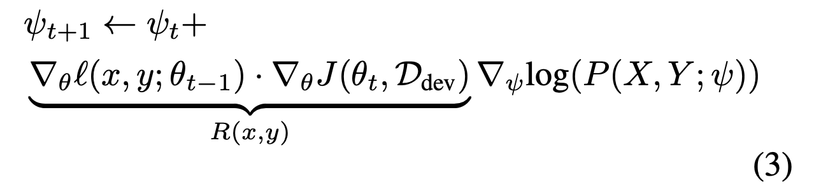
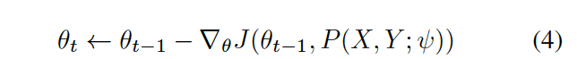
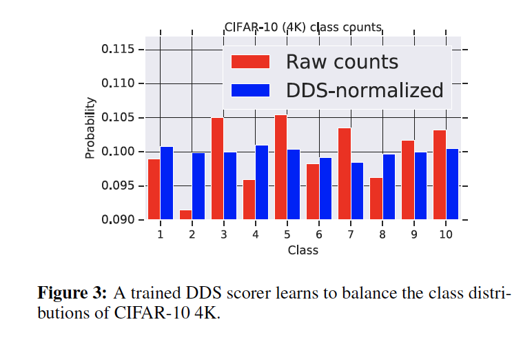
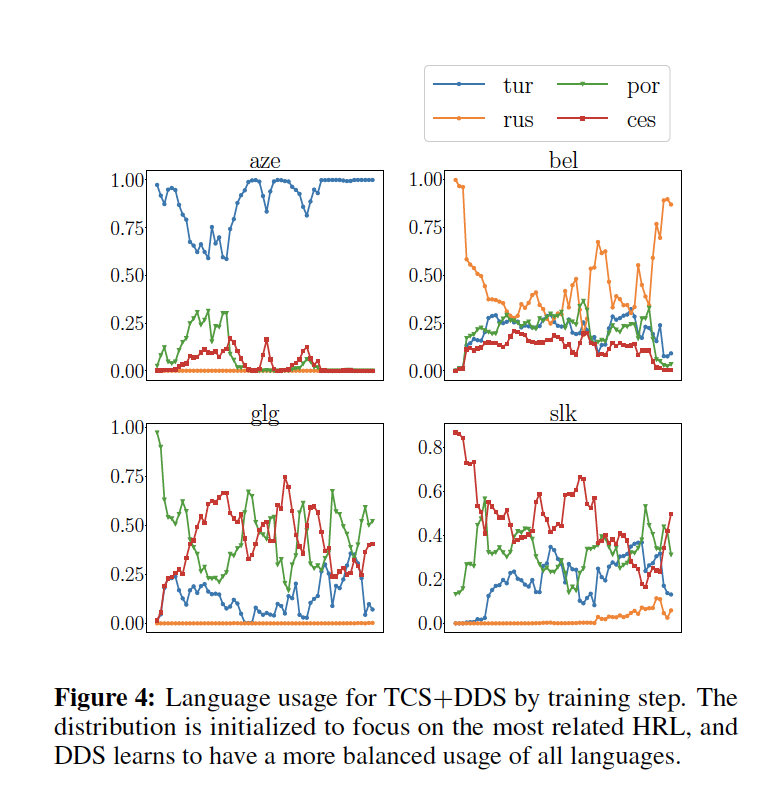

# Optimizing Data Usage via Differentiable Rewards

ICML 2020

## Resource

- [arXiv](https://arxiv.org/abs/1911.10088)

## Summary
- DDS (Differentiable Data Selection) 알고리즘 제안
- 중요한 데이터를 더 많이 보고 싶다. 중요함 정도를 어떻게 정의할 것인가? dev set에서 잘 동작하게끔 학습시키는 친구들이 중요한 친구들일 것이다.
- example마다 중요함 정도를 내뱉는 scorer을 학습시킨 후, 그만큼 weight를 줘서 메인 모델을 학습하자.
- Image classification과 multilingual NMT에서 잘 했다.

## Differentiable Data Selection
### Risk

- 어떤 distribution P(X,Y)에 대하여 loss를 minimize 하는 theta를 찾고 싶다.
- 어떤 distribution에 대하여 찾을 것인가?
  - 궁극적으로는 test distribution에 대하여 loss를 minimize 하고 싶다. 그러나 test distribution은 모른다.
  - train data distribution에 대해 찾을 수도 있겠지만 (empirical risk), 이는 test distribution과 비슷하지 않을 수 있다.
  - dev data distribution은 train data보다 test distribution에 가까우리라고 생각된다.
  - dev distribution을 참고하여 scorer가 만든 어떤 distribution P(X,Y)에 대해 J(theta, P)를 minimize하는 theta를 찾으면, J(theta, D_dev)가 minimize 된다.
    - J(theta, D_dev)를 직접 minimize 하면 안 되나? -> 데이터가 너무 적다. D_dev로부터 feedback을 얻어서 D_train을 적절히 학습하자.
- Model의 parameter은 theta이고, scorer의 parameter은 psi 이다.

### Learning to Optimize Data Usage
- Paper에서는 scorer을 RL agent로 보고, (2)번 식의 reward를 받아서, REINFORCE를 적용한다고 설명하고 있다.
  - P(X, Y;psi)를 policy라고 간주하고,
  - Reward의 policy에 대한 expectation을 maximize 한다.

    
  - 위를 maximize하는 P(X,Y;psi)를 찾고 싶다고 생각해도 좋다.

- R은 다음과 같이 정의된다.

  

- 그러면 psi는 아래와 같이 update 하면 된다.

  

  - 이로부터 (3)식과 같아진다.

    

- theta는 (4)식과 같이 update 하면 된다.

  

  이렇게 theta와 psi를 iterative 하게 training 할 수 있다.

- 여기까지 보면 iterative 하게 training 한다고 해서 improvement가 보장된 건 아닌 것 같아 보인다. Reward의 정의 속에, dev set gradient와 방향이 비슷한 친구들이 training에 도움이 된다는 가정이 숨어있는 것 처럼 보인다.

### Deriving Rewards through Direct Differentiation
- 근데 (3)번 식은 사실, (5)번식 bi-level optimization problem의 approximated solution이다.

  

  - 증명은 (6)에 있다.
  - 그러니까 (3)번 식은, theta가 train data에 대한 risk를 minimize 할 때, dev data에 대한 risk를 minimize 하는 psi를 학습한다.
  - 물론 여전히 가정이 들어있다 -- dev data에 대한 risk를 minimize 하는 psi가 만드는 분포로 train data를 학습하면 test data에 대해 더 좋은 성능을 낼 것이다. 이는 dev data가 test data에 더 가까운 분포를 가지리라는 가정에서 온다.

### Additional Derivation Details and Clarifications
- J(theta_t, D_dev)에 대해서 psi를 optimize 하면 D_dev set이 작으니까 overfitting이 일어나지 않는가?
  - psi는 theta에 indirect 하게 영향을 준다.
  - training example들은 D_train에서 sample된 subset이다.

## Concrete Instantiations of DDS
### Formulation for Classification
- Algorithm 1
  - 특이점: per-sample gradient를 계산해야 해서 compute가 costly 해질 수 있어서, Taylor expansion으로 (7)번 식과 같이 approximation 하였다.

### Formulation for Multilingual NMT
- Algorithm 2
  - 특이점: p(X,Y;psi)를 modeling 하는 대신, conditional distribution p(X|y;psi)를 modeling 하였다. 이는 TCS라는 기존 SOTA data selection 방법에서 heuristic을 써서 p(X|y)를 modeling 한 것에서 가져온 디자인이다.

## Experiments

- Uniform 보다는 잘 했다. (data selected uniformly)
- SPCL은 쉬운 친구 부터 배우는 curriculum learning인데, 이는 dev set distribution과 상관 없이 train data의 "easiness"만 갖고 판단하기 때문에 성능이 떨어진다.
  - 특히 multilingual NMT에서는, train language는 high resource이고 dev language는 low resource라서 매우 다른 properties를 가질 것이다.
- Vanilla DDS가 classification에서는 기존 방법들보다 잘 했다.
- Vanilla DDS가 multilingual NMT에서는 기존 방법들과 비슷한 수준이었다.
- Prior knowledge를 썼을 때는 좀더 성능이 올라갔다.
  - retrained DDS: DDS로 psi, theta를 training 시킨 후에 psi를 남기고 theta는 처음부터 다시 DDS training
  - TCS+DDS: DDS param들을 TCS heuristic으로 initialize 시킨 후 training
- Computation overhead: classification에 대해 1.5배, NMT에 대해 2배 training time

### Analysis
- Classification
  - train data에서는 class distribution의 balance가 안 맞지만 DDS는 balance를 맞춘다. 

    
  - 더 clearer한 그림에 weight를 더 준다.

    
- NMT
  - TCS+DDS를 했을 때 초반의 TCS는 target LRL과 largest vocab. overlap을 가진 HRL을 높이지만 training 하면서 percentage가 줄어든다.
  - DDS가 여러 language를 균형있게 보면서 이득을 취해간다고 볼 수 있겠다.

    

